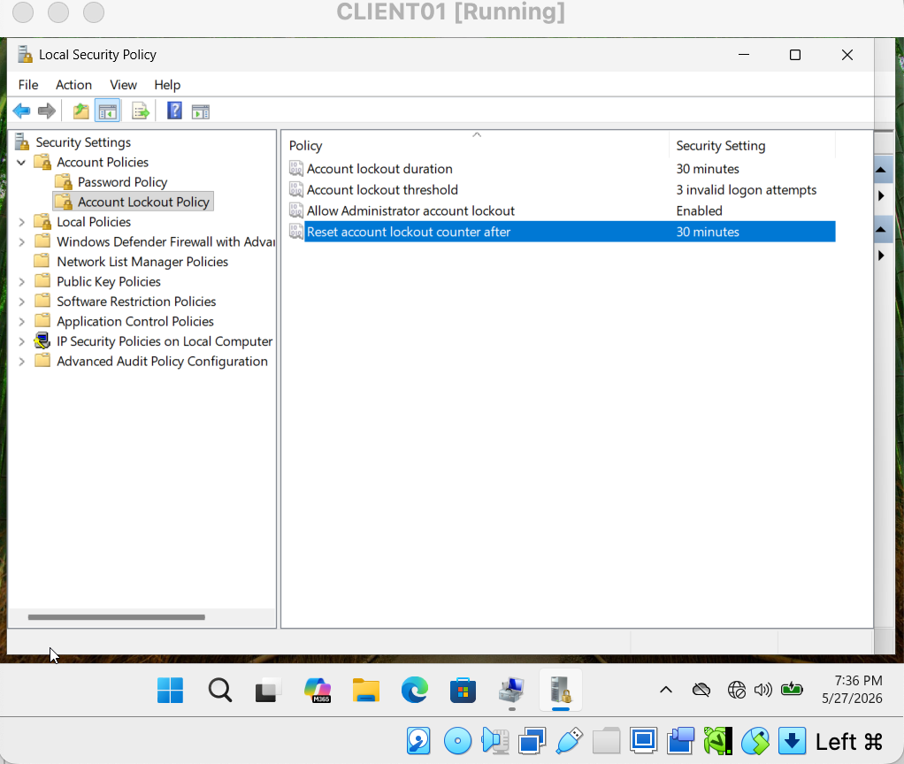
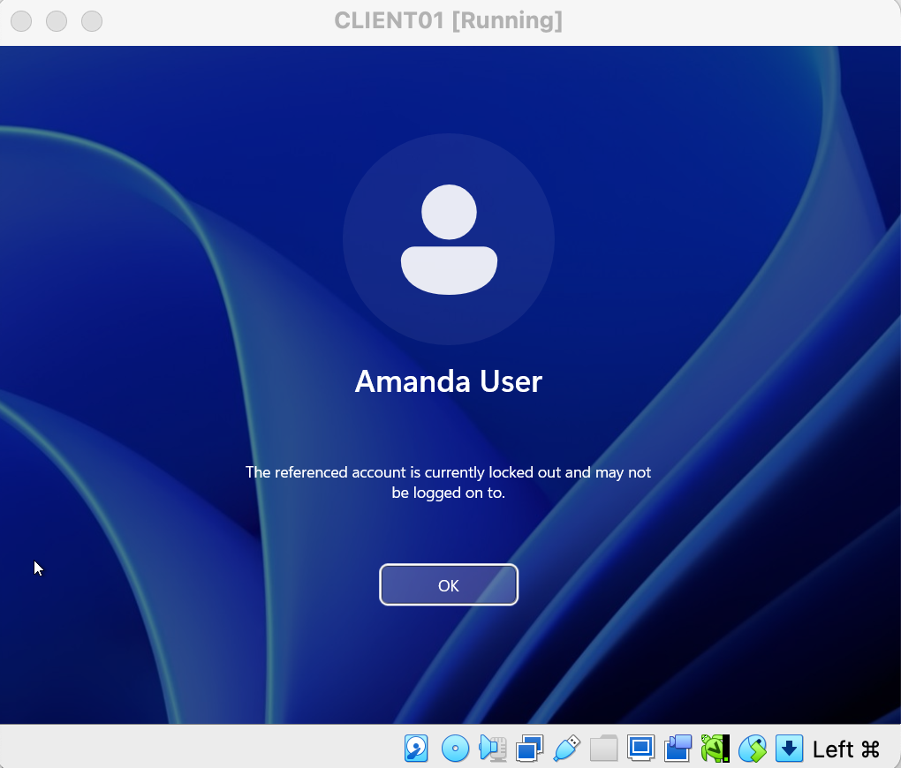
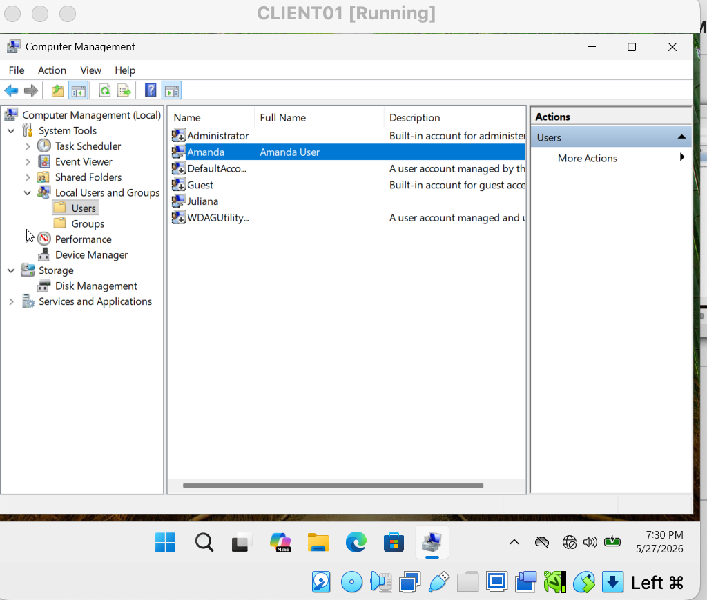
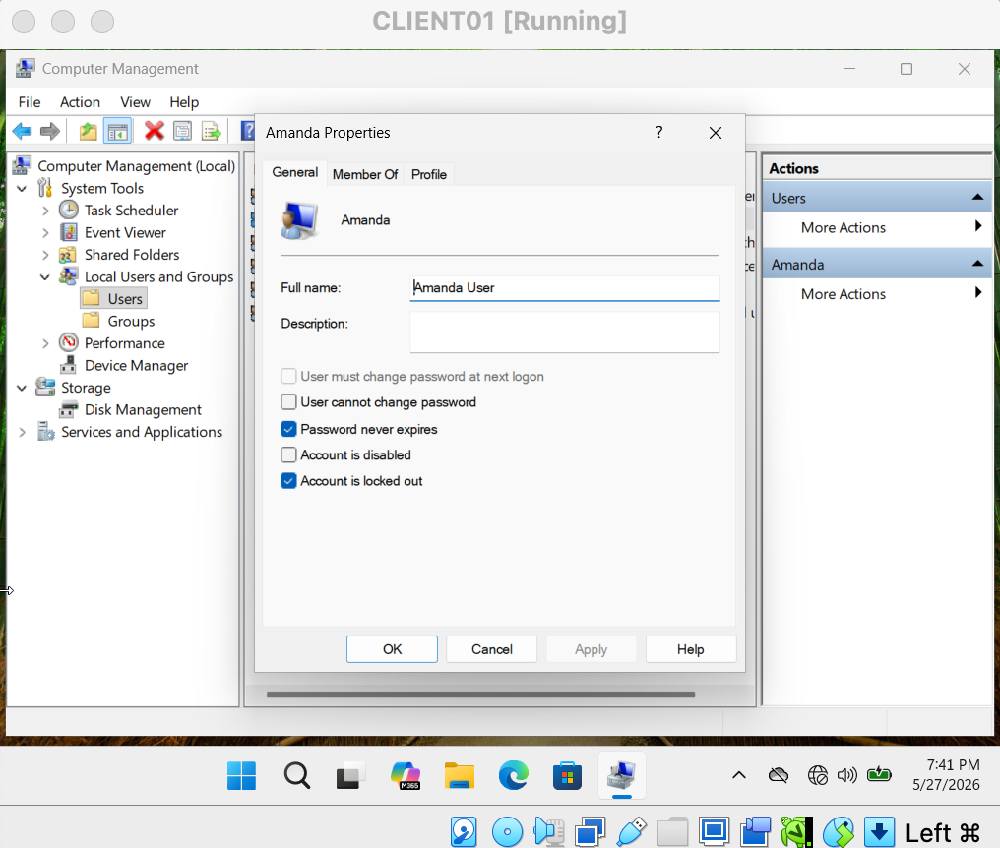
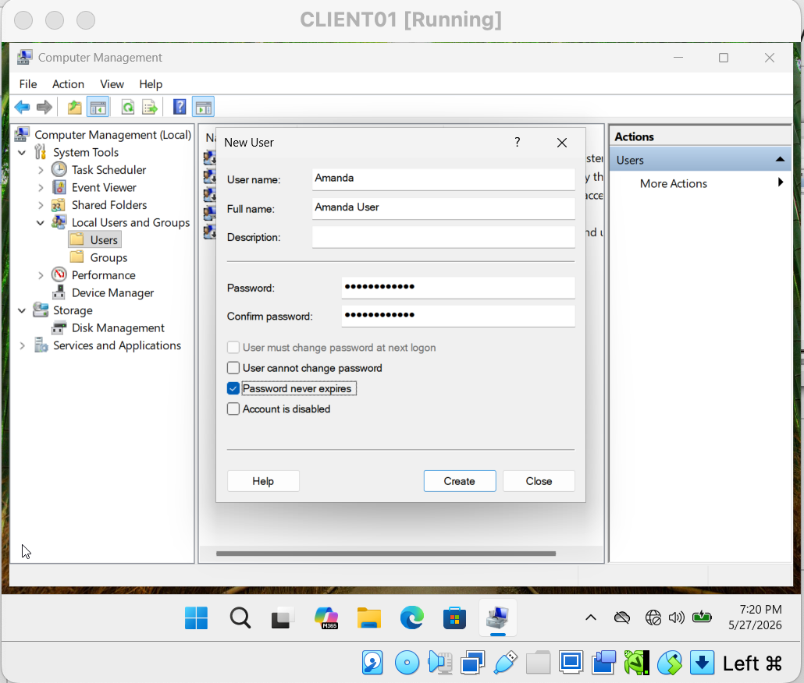
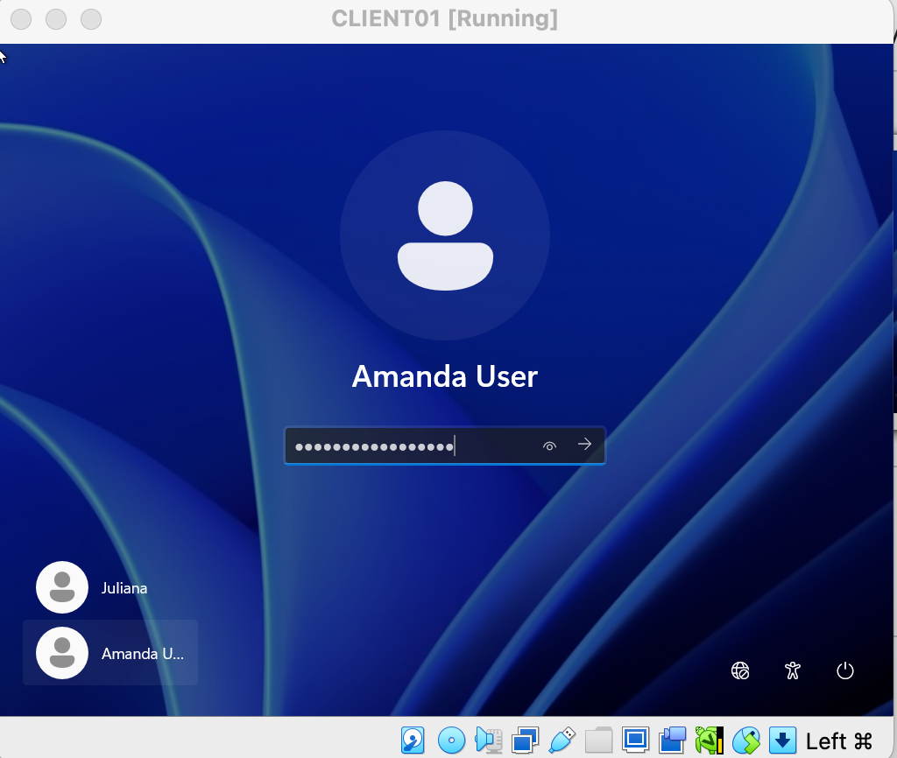

# Ticket 01 — Account Lockout / User Cannot Log In

## Ticket Summary

A user account became locked after multiple failed login attempts.
The issue was resolved by accessing the local user account settings through Computer Management and unlocking the affected account.

---

# Environment

* Windows 11 Virtual Machine
* VirtualBox
* Local User Accounts
* Local Security Policy
* Computer Management

---

# Ticket Scenario

A user reported being unable to log into their Windows account after entering the wrong password multiple times.

The objective was to:

* Configure an account lockout policy
* Trigger the lockout condition
* Investigate the issue
* Unlock the user account
* Restore successful login access

---

# Troubleshooting Process

## 1. Configured Account Lockout Policy

Opened Local Security Policy and configured:

* Account Lockout Threshold = 3 invalid logon attempts

---

## 2. Triggered Account Lockout

Entered the incorrect password multiple times until the account became locked.

---

## 3. Accessed Local Users Through Computer Management

Logged in as the administrator and opened:

Computer Management → Local Users and Groups → Users

---

## 4. Verified Locked Account Status

Opened the affected user account properties and confirmed the account was locked.

---

## 5. Unlocked the User Account

Removed the account lockout status to restore user access.

---

## 6. Confirmed Successful Login

Tested the user account again and confirmed successful login access.

---

# Skills Demonstrated

* Windows Troubleshooting
* Account Lockout Resolution
* Local Security Policy Configuration
* Computer Management
* User Account Administration
* Help Desk Troubleshooting Workflow
* Windows 11 Administration
* VirtualBox Lab Environment

---

# Outcome

Successfully simulated and resolved a real-world Help Desk ticket involving a locked Windows user account.
