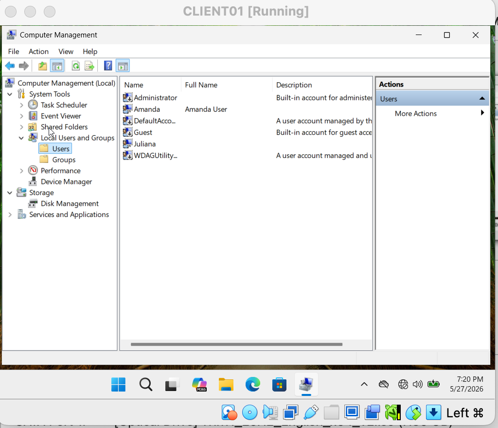
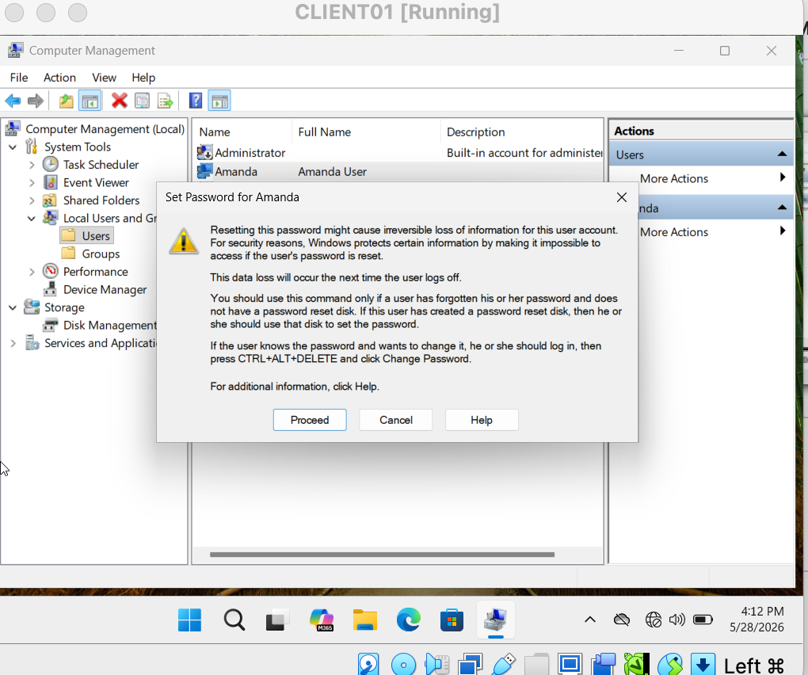
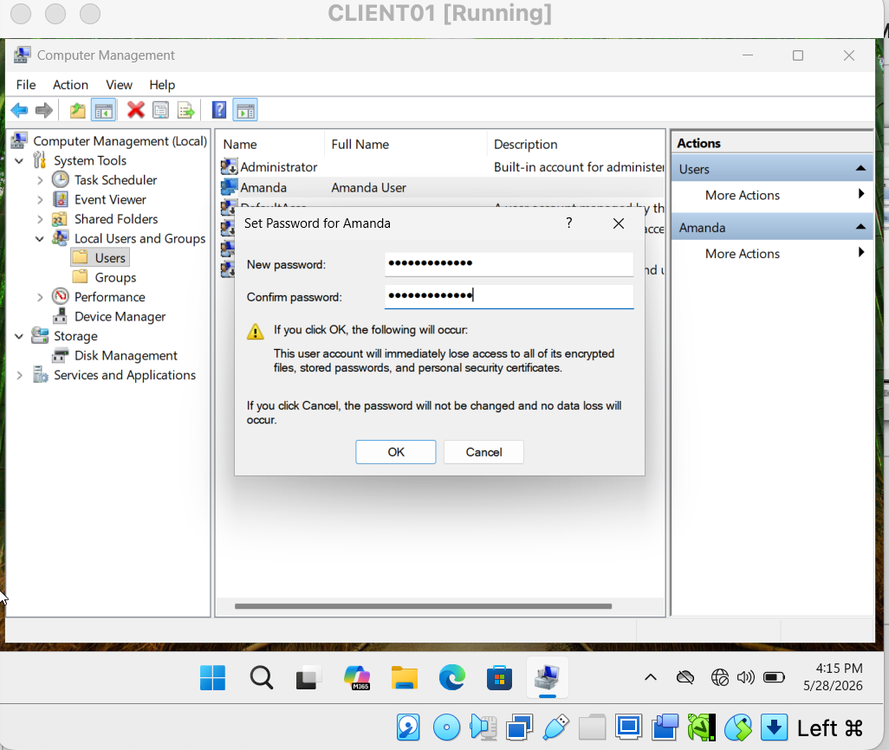
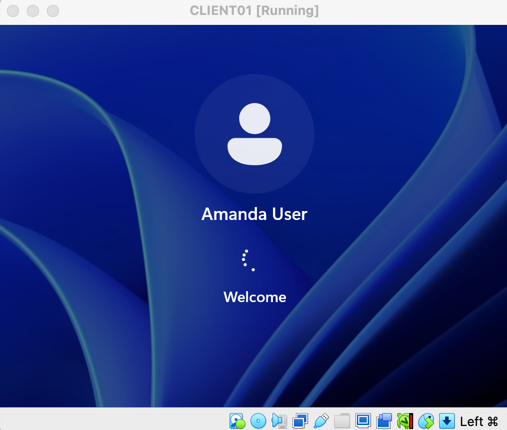

# Ticket 02 — Password Reset / User Forgot Password

## Ticket Summary

A user was unable to access their Windows account after forgetting their password.
The issue was resolved by resetting the password through Computer Management using an administrator account.

---

# Environment

* Windows 11 Virtual Machine
* VirtualBox
* Local User Accounts
* Computer Management

---

# Ticket Scenario

A user reported being unable to log into their Windows account due to a forgotten password.

The objective was to:

* Access the account through administrative tools
* Reset the user password
* Restore successful login access

---

# Troubleshooting Process

## 1. Accessed Local Users Through Computer Management

Logged in as the administrator and opened:

Computer Management → Local Users and Groups → Users

---

## 2. Opened Password Reset Option

Right-clicked the affected user account and selected:

Set Password...

---

## 3. Reset the User Password

Configured a new password for the affected user account.

---

## 4. Confirmed Successful Login

Tested the account with the new password and confirmed successful login access.

---

# Skills Demonstrated

* Windows Troubleshooting
* Password Reset Procedures
* User Account Administration
* Computer Management
* Help Desk Support Workflow
* Windows 11 Administration
* Administrative Troubleshooting

---

# Outcome

Successfully simulated and resolved a common Help Desk ticket involving a forgotten Windows password.
